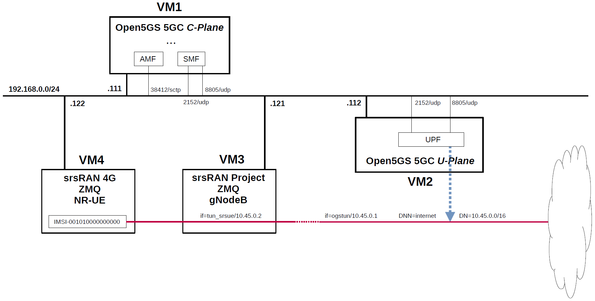

# Open5GS 5GC & srsRAN 5G with ZeroMQ UE / RAN Sample Configuration
srsRAN_Project and srsRAN_4G software suites include a virtual radio which uses the ZeroMQ networking library to transfer radio samples between applications.
Therefore, in order to use U-Plane's DN (Data Network) as a trial, I built a simulation environment for the 5GC mobile network.
This briefly describes the overall and configuration files in the Virtualbox VM environment.

---

<h2 id="conf_list">List of Sample Configurations</h2>

1. [One SGW-C/PGW-C, one SGW-U/PGW-U and one APN](https://github.com/s5uishida/open5gs_epc_srsran_sample_config)
2. [One SGW-C/PGW-C, Multiple SGW-Us/PGW-Us and APNs](https://github.com/s5uishida/open5gs_epc_oai_sample_config)
3. One SMF, one UPF and one DNN (this article)
4. [One SMF, Multiple UPFs and DNNs](https://github.com/s5uishida/open5gs_5gc_ueransim_sample_config)
5. [Select nearby UPF(PGW-U) according to the connected eNodeB](https://github.com/s5uishida/open5gs_epc_srsran_nearby_upf_sample_config)
6. [Select nearby UPF according to the connected gNodeB](https://github.com/s5uishida/open5gs_5gc_ueransim_nearby_upf_sample_config)
7. [Select UPF based on S-NSSAI](https://github.com/s5uishida/open5gs_5gc_ueransim_snssai_upf_sample_config)
8. [SCP Indirect communication Model C](https://github.com/s5uishida/open5gs_5gc_ueransim_scp_model_c_sample_config)
9. [VoLTE and SMS Configuration for docker_open5gs](https://github.com/s5uishida/docker_open5gs_volte_sms_config)
10. [Monitoring Metrics with Prometheus](https://github.com/s5uishida/open5gs_5gc_ueransim_metrics_sample_config)
11. [Framed Routing](https://github.com/s5uishida/open5gs_5gc_ueransim_framed_routing_sample_config)
12. [VPP-UPF(PGW-U) with DPDK](https://github.com/s5uishida/open5gs_epc_srsran_vpp_upf_dpdk_sample_config)
13. [VPP-UPF with DPDK](https://github.com/s5uishida/open5gs_5gc_ueransim_vpp_upf_dpdk_sample_config)
---

<h2 id="misc">Miscellaneous Notes</h2>

- [Install MongoDB 6.0 and Open5GS WebUI](https://github.com/s5uishida/open5gs_install_mongodb6_webui)
- [Install MongoDB 4.4.18 on Ubuntu 20.04 for Raspberry Pi 4B](https://github.com/s5uishida/install_mongodb_on_ubuntu_for_rp4b)
- [Build srsRAN_Project 5G RAN with ZeroMQ](https://github.com/s5uishida/build_srsran_5g_zmq)
- [Build srsRAN 4G UE / RAN with ZeroMQ by disabling RF plugins](https://github.com/s5uishida/build_srsran_4g_zmq_disable_rf_plugins)
- [A Note for 5G SUCI Profile A/B Scheme](https://github.com/s5uishida/note_5g_suci_profile_ab)
- [A Note for Changing Network Interface of UPF from TUN to TAP in Open5GS](https://github.com/s5uishida/change_from_tun_to_tap_in_open5gs)
---

<h2 id="toc">Table of Contents</h2>

- [Overview of Open5GS 5GC Simulation Mobile Network](#overview)
- [Changes in configuration files of Open5GS 5GC and srsRAN 5G ZMQ UE / RAN](#changes)
  - [Changes in configuration files of Open5GS 5GC C-Plane](#changes_cp)
  - [Changes in configuration files of Open5GS 5GC U-Plane](#changes_up)
  - [Changes in configuration files of srsRAN 5G ZMQ UE / RAN](#changes_srs)
    - [Changes in configuration files of RAN](#changes_ran)
    - [Changes in configuration files of UE](#changes_ue)
- [Network settings of Open5GS 5GC](#network_settings)
  - [Network settings of Open5GS 5GC U-Plane](#network_settings_up)
- [Build Open5GS and srsRAN 5G ZMQ UE / RAN](#build)
- [Run Open5GS 5GC and srsRAN 5G ZMQ UE / RAN](#run)
  - [Run Open5GS 5GC C-Plane](#run_cp)
  - [Run Open5GS 5GC U-Plane](#run_up)
  - [Run srsRAN 5G ZMQ RAN](#run_ran)
  - [Run srsRAN 5G ZMQ UE](#run_ue)
- [Ping google.com](#ping)
  - [Case for going through DN 10.45.0.0/16](#ping_1)
- [Issues](#issues)
- [Changelog (summary)](#changelog)
---

<h2 id="overview">Overview of Open5GS 5GC Simulation Mobile Network</h2>

I created a 5GC mobile network (Internet reachable) for simulation with the aim of creating an environment in which packets can be sent end-to-end with one DN for one DNN.

The following minimum configuration was set as a condition.
- Only one each for C-Plane, U-Plane and UE.

The built simulation environment is as follows.

</img>

The 5GC / UE / RAN used are as follows.
- 5GC - Open5GS v2.6.4 (2023.08.26) - https://github.com/open5gs/open5gs
- RAN - srsRAN Project (2023.08.26) - https://github.com/srsran/srsRAN_Project
- UE (NR-UE) - srsRAN 4G (2023.08.26) - https://github.com/srsran/srsRAN_4G

Each VMs are as follows.  
| VM # | SW & Role | IP address | OS | Memory <br> (Min) | HDD <br> (Min) |
| --- | --- | --- | --- | --- | --- |
| VM1 | Open5GS 5GC C-Plane | 192.168.0.111/24 | Ubuntu 22.04 | 1GB | 20GB |
| VM2 | Open5GS 5GC U-Plane  | 192.168.0.112/24 | Ubuntu 22.04 | 1GB | 20GB |
| VM3 | srsRAN Project ZMQ RAN (gNodeB) | 192.168.0.121/24 | Ubuntu 22.04 | 4GB | 10GB |
| VM4 | srsRAN 4G ZMQ UE (NR-UE) | 192.168.0.122/24 | Ubuntu 22.04 | 2GB | 10GB |

AMF & SMF addresses are as follows.  
| NF | IP address | IP address on SBI | Supported S-NSSAI |
| --- | --- | --- | --- |
| AMF | 192.168.0.111 | 127.0.0.5 | SST:1, SD:0x000001 |
| SMF | 192.168.0.111 | 127.0.0.4 | SST:1, SD:0x000001 |

Subscriber Information (other information is the same) is as follows.  
| UE | IMSI | DNN | OP/OPc | S-NSSAI |
| --- | --- | --- | --- | --- |
| UE (NR-UE) | 001010000000000 | internet | OPc | SST:1, SD:0x000001 |

I registered these information with the Open5GS WebUI.
In addition, [3GPP TS 35.208](https://www.3gpp.org/DynaReport/35208.htm) "4.3 Test Sets" is published by 3GPP as test data for the 3GPP authentication and key generation functions (MILENAGE).

DN is as follows.
| DN | S-NSSAI | TUNnel interface of DN | DNN | TUNnel interface of UE |
| --- | --- | --- | --- | --- |
| 10.45.0.0/16 | SST:1 <br> SD:0x000001 | ogstun | internet | tun_srsue |

The main information of gNodeB is as follows.
| MCC | MNC | TAC | gNodeB ID |
| --- | --- | --- | --- |
| 001 | 01 | 1 | 0x19b |

Additional information.

Open5GS 5GC U-Plane worked fine on Raspberry Pi 4 Model B. I used [Ubuntu 20.04 (64bit) for Raspberry Pi 4](https://ubuntu.com/download/raspberry-pi) as the OS. I think it would be convenient to place a compact U-Plane in the edge environment and use it as an end-point for DN.

In addition, I have not confirmed the communication performance.

<h2 id="changes">Changes in configuration files of Open5GS 5GC and srsRAN 5G ZMQ UE / RAN</h2>

Please refer to the following for building Open5GS and srsRAN 5G ZMQ UE / RAN respectively.
- Open5GS v2.6.4 (2023.08.26) - https://open5gs.org/open5gs/docs/guide/02-building-open5gs-from-sources/
- srsRAN Project (RAN) (2023.08.26) - https://github.com/s5uishida/build_srsran_5g_zmq
- srsRAN 4G (UE) (2023.08.26) - https://github.com/s5uishida/build_srsran_4g_zmq_disable_rf_plugins

<h3 id="changes_cp">Changes in configuration files of Open5GS 5GC C-Plane</h3>

The following parameters including DNN can be used in the logic that selects UPF as the connection destination by PFCP.

- DNN
- TAC (Tracking Area Code)
- nr_CellID

For the sake of simplicity, I used only DNN this time. Please refer to [here](https://github.com/open5gs/open5gs/pull/560#issue-483001043) for the logic to select UPF.

<h3 id="changes_cp">Changes in configuration files of Open5GS 5GC C-Plane</h3>

- `open5gs/install/etc/open5gs/amf.yaml`
```diff
--- amf.yaml.orig       2023-08-26 17:34:58.000000000 +0900
+++ amf.yaml    2023-08-26 17:55:14.356847505 +0900
@@ -474,28 +474,29 @@
       - addr: 127.0.0.5
         port: 7777
     ngap:
-      - addr: 127.0.0.5
+      - addr: 192.168.0.111
     metrics:
       - addr: 127.0.0.5
         port: 9090
     guami:
       - plmn_id:
-          mcc: 999
-          mnc: 70
+          mcc: 001
+          mnc: 01
         amf_id:
           region: 2
           set: 1
     tai:
       - plmn_id:
-          mcc: 999
-          mnc: 70
+          mcc: 001
+          mnc: 01
         tac: 1
     plmn_support:
       - plmn_id:
-          mcc: 999
-          mnc: 70
+          mcc: 001
+          mnc: 01
         s_nssai:
           - sst: 1
+            sd: 000001
     security:
         integrity_order : [ NIA2, NIA1, NIA0 ]
         ciphering_order : [ NEA0, NEA1, NEA2 ]
```
- `open5gs/install/etc/open5gs/smf.yaml`
```diff
--- smf.yaml.orig       2023-08-26 17:34:58.000000000 +0900
+++ smf.yaml    2023-08-26 17:54:41.609843715 +0900
@@ -602,25 +602,20 @@
       - addr: 127.0.0.4
         port: 7777
     pfcp:
-      - addr: 127.0.0.4
-      - addr: ::1
+      - addr: 192.168.0.111
     gtpc:
       - addr: 127.0.0.4
-      - addr: ::1
     gtpu:
-      - addr: 127.0.0.4
-      - addr: ::1
+      - addr: 192.168.0.111
     metrics:
       - addr: 127.0.0.4
         port: 9090
     subnet:
       - addr: 10.45.0.1/16
-      - addr: 2001:db8:cafe::1/48
+        dnn: internet
     dns:
       - 8.8.8.8
       - 8.8.4.4
-      - 2001:4860:4860::8888
-      - 2001:4860:4860::8844
     mtu: 1400
     ctf:
       enabled: auto
@@ -808,7 +803,8 @@
 #
 upf:
     pfcp:
-      - addr: 127.0.0.7
+      - addr: 192.168.0.112
+        dnn: internet
 
 #
 #  o Disable use of IPv4 addresses (only IPv6)
```

<h3 id="changes_up">Changes in configuration files of Open5GS 5GC U-Plane</h3>

- `open5gs/install/etc/open5gs/upf.yaml`
```diff
--- upf.yaml.orig       2023-08-26 17:34:58.000000000 +0900
+++ upf.yaml    2023-08-26 17:57:55.068477294 +0900
@@ -196,12 +196,13 @@
 #
 upf:
     pfcp:
-      - addr: 127.0.0.7
+      - addr: 192.168.0.112
     gtpu:
-      - addr: 127.0.0.7
+      - addr: 192.168.0.112
     subnet:
       - addr: 10.45.0.1/16
-      - addr: 2001:db8:cafe::1/48
+        dnn: internet
+        dev: ogstun
     metrics:
       - addr: 127.0.0.7
         port: 9090
```

<h3 id="changes_srs">Changes in configuration files of srsRAN 5G ZMQ UE / RAN</h3>

<h4 id="changes_ran">Changes in configuration files of RAN</h4>

See [here](https://github.com/s5uishida/build_srsran_5g_zmq#create-the-configuration-file-of-gnodeb) for the original files.

- `srsRAN_Project/build/apps/gnb/gnb_zmq.yaml`
```diff
--- gnb_zmq.yaml.orig   2023-07-07 00:32:21.000000000 +0900
+++ gnb_zmq.yaml        2023-08-26 18:06:39.534791708 +0900
@@ -3,13 +3,19 @@
 # To run the srsRAN Project gNB with this config, use the following command: 
 #   sudo ./gnb -c gnb_zmq.yaml
 
+gnb_id: 0x19B
+
+slicing:
+  - sst: 1
+    sd: 1
+
 amf:
-  addr: 10.53.1.2                  # The address or hostname of the AMF.
-  bind_addr: 10.53.1.1             # A local IP that the gNB binds to for traffic from the AMF.
+  addr: 192.168.0.111                  # The address or hostname of the AMF.
+  bind_addr: 192.168.0.121             # A local IP that the gNB binds to for traffic from the AMF.
 
 ru_sdr:
   device_driver: zmq                # The RF driver name.
-  device_args: tx_port=tcp://127.0.0.1:2000,rx_port=tcp://127.0.0.1:2001,base_srate=11.52e6 # Optionally pass arguments to the selected RF driver.
+  device_args: tx_port=tcp://192.168.0.121:2000,rx_port=tcp://192.168.0.122:2001,base_srate=11.52e6 # Optionally pass arguments to the selected RF driver.
   srate: 11.52                      # RF sample rate might need to be adjusted according to selected bandwidth.
   tx_gain: 75                       # Transmit gain of the RF might need to adjusted to the given situation.
   rx_gain: 75                       # Receive gain of the RF might need to adjusted to the given situation.
@@ -20,7 +26,7 @@
   channel_bandwidth_MHz: 10         # Bandwith in MHz. Number of PRBs will be automatically derived.
   common_scs: 15                    # Subcarrier spacing in kHz used for data.
   plmn: "00101"                     # PLMN broadcasted by the gNB.
-  tac: 7                            # Tracking area code (needs to match the core configuration).
+  tac: 1                            # Tracking area code (needs to match the core configuration).
   pdcch:
     dedicated:
       ss2_type: common              # Search Space type, has to be set to common
```

<h4 id="changes_ue">Changes in configuration files of UE</h4>

See [here](https://github.com/s5uishida/build_srsran_4g_zmq_disable_rf_plugins#create-the-configuration-file-of-nr-ue) for the original files.

- `srsRAN_4G/build/srsue/ue_zmq.conf`
```diff
--- ue_zmq.conf.orig    2023-04-24 18:36:33.000000000 +0900
+++ ue_zmq.conf 2023-08-26 18:09:17.043564563 +0900
@@ -6,7 +6,7 @@
 nof_antennas = 1
 
 device_name = zmq
-device_args = tx_port=tcp://127.0.0.1:2001,rx_port=tcp://127.0.0.1:2000,base_srate=11.52e6
+device_args = tx_port=tcp://192.168.0.122:2001,rx_port=tcp://192.168.0.121:2000,base_srate=11.52e6
 
 [rat.eutra]
 dl_earfcn = 2850
@@ -32,9 +32,9 @@
 [usim]
 mode = soft
 algo = milenage
-opc  = 63BFA50EE6523365FF14C1F45F88737D
-k    = 00112233445566778899aabbccddeeff
-imsi = 001010123456780
+opc  = E8ED289DEBA952E4283B54E88E6183CA
+k    = 465B5CE8B199B49FAA5F0A2EE238A6BC
+imsi = 001010000000000
 imei = 353490069873319
 
 [rrc]
@@ -42,11 +42,16 @@
 ue_category = 4
 
 [nas]
-apn = srsapn
+apn = internet
 apn_protocol = ipv4
 
+[slicing]
+enable = true
+nssai-sst = 1
+nssai-sd = 1
+
 [gw]
-netns = ue1
+#netns = ue1
 ip_devname = tun_srsue
 ip_netmask = 255.255.255.0
 
```

<h2 id="network_settings">Network settings of Open5GS 5GC</h2>

<h3 id="network_settings_up">Network settings of Open5GS 5GC U-Plane</h3>

First, uncomment the next line in the `/etc/sysctl.conf` file and reflect it in the OS.
```
net.ipv4.ip_forward=1
```
```
# sysctl -p
```
Next, configure the TUNnel interface and NAPT.
```
ip tuntap add name ogstun mode tun
ip addr add 10.45.0.1/16 dev ogstun
ip link set ogstun up

iptables -t nat -A POSTROUTING -s 10.45.0.0/16 ! -o ogstun -j MASQUERADE
```

<h2 id="build">Build Open5GS and srsRAN 5G ZMQ UE / RAN</h2>

Please refer to the following for building Open5GS and srsRAN 5G ZMQ UE / RAN respectively.
- Open5GS v2.6.4 (2023.08.26) - https://open5gs.org/open5gs/docs/guide/02-building-open5gs-from-sources/
- srsRAN Project (RAN) (2023.08.26) - https://github.com/s5uishida/build_srsran_5g_zmq
- srsRAN 4G (UE) (2023.08.26) - https://github.com/s5uishida/build_srsran_4g_zmq_disable_rf_plugins

Install MongoDB on Open5GS 5GC C-Plane machine.
It is not necessary to install MongoDB on Open5GS 5GC U-Plane machines.
[MongoDB Compass](https://www.mongodb.com/products/compass) is a convenient tool to look at the MongoDB database.

<h2 id="run">Run Open5GS 5GC and srsRAN 5G ZMQ UE / RAN</h2>

First run the 5GC, then the RAN, and the UE.

<h3 id="run_cp">Run Open5GS 5GC C-Plane</h3>

First, run Open5GS 5GC C-Plane.

- Open5GS 5GC C-Plane
```
./install/bin/open5gs-nrfd &
sleep 2
./install/bin/open5gs-scpd &
sleep 2
./install/bin/open5gs-amfd &
sleep 2
./install/bin/open5gs-smfd &
./install/bin/open5gs-ausfd &
./install/bin/open5gs-udmd &
./install/bin/open5gs-udrd &
./install/bin/open5gs-pcfd &
./install/bin/open5gs-nssfd &
./install/bin/open5gs-bsfd &
```

<h3 id="run_up">Run Open5GS 5GC U-Plane</h3>

Next, run Open5GS 5GC U-Plane.

- Open5GS 5GC U-Plane
```
./install/bin/open5gs-upfd &
```

<h3 id="run_ran">Run srsRAN 5G ZMQ RAN</h3>

Run srsRAN 5G ZMQ RAN and connect to Open5GS 5GC.
```
# cd srsRAN_Project/build/apps/gnb
#  ./gnb -c gnb_zmq.yaml
Lower PHY in executor blocking mode.

--== srsRAN gNB (commit 1afd7240f) ==--

Connecting to AMF on 192.168.0.111:38412
Available radio types: zmq.
Cell pci=1, bw=10 MHz, dl_arfcn=368500 (n3), dl_freq=1842.5 MHz, dl_ssb_arfcn=368410, ul_freq=1747.5 MHz

==== gNodeB started ===
Type <t> to view trace
```
The Open5GS C-Plane log when executed is as follows.
```
08/26 20:36:19.009: [amf] INFO: gNB-N2 accepted[192.168.0.121]:34049 in ng-path module (../src/amf/ngap-sctp.c:113)
08/26 20:36:19.009: [amf] INFO: gNB-N2 accepted[192.168.0.121] in master_sm module (../src/amf/amf-sm.c:741)
08/26 20:36:19.009: [amf] INFO: [Added] Number of gNBs is now 1 (../src/amf/context.c:1185)
08/26 20:36:19.009: [amf] INFO: gNB-N2[192.168.0.121] max_num_of_ostreams : 30 (../src/amf/amf-sm.c:780)
```

<h3 id="run_ue">Run srsRAN 5G ZMQ UE</h3>

Run srsRAN 5G ZMQ UE and connect to Open5GS 5GC.
```
# cd srsRAN_4G/build/srsue
# ./src/srsue ue_zmq.conf
Reading configuration file ue_zmq.conf...

Built in Release mode using commit fa56836b1 on branch master.

Opening 1 channels in RF device=zmq with args=tx_port=tcp://192.168.0.122:2001,rx_port=tcp://192.168.0.121:2000,base_srate=11.52e6
Supported RF device list: zmq file
CHx base_srate=11.52e6
Current sample rate is 1.92 MHz with a base rate of 11.52 MHz (x6 decimation)
CH0 rx_port=tcp://192.168.0.121:2000
CH0 tx_port=tcp://192.168.0.122:2001
Current sample rate is 11.52 MHz with a base rate of 11.52 MHz (x1 decimation)
Current sample rate is 11.52 MHz with a base rate of 11.52 MHz (x1 decimation)
Waiting PHY to initialize ... done!
Attaching UE...
Random Access Transmission: prach_occasion=0, preamble_index=0, ra-rnti=0x39, tti=334
Random Access Complete.     c-rnti=0x4601, ta=0
RRC Connected
PDU Session Establishment successful. IP: 10.45.0.2
RRC NR reconfiguration successful.
```
The Open5GS C-Plane log when executed is as follows.
```
08/26 20:40:03.421: [amf] INFO: InitialUEMessage (../src/amf/ngap-handler.c:401)
08/26 20:40:03.421: [amf] INFO: [Added] Number of gNB-UEs is now 1 (../src/amf/context.c:2517)
08/26 20:40:03.421: [amf] INFO:     RAN_UE_NGAP_ID[0] AMF_UE_NGAP_ID[1] TAC[1] CellID[0x19b0] (../src/amf/ngap-handler.c:562)
08/26 20:40:03.422: [amf] INFO: [suci-0-001-01-0000-0-0-0000000000] Unknown UE by SUCI (../src/amf/context.c:1783)
08/26 20:40:03.422: [amf] INFO: [Added] Number of AMF-UEs is now 1 (../src/amf/context.c:1570)
08/26 20:40:03.422: [gmm] INFO: Registration request (../src/amf/gmm-sm.c:1061)
08/26 20:40:03.422: [gmm] INFO: [suci-0-001-01-0000-0-0-0000000000]    SUCI (../src/amf/gmm-handler.c:152)
08/26 20:40:03.424: [sbi] WARNING: [c2ecefdc-4404-41ee-8d77-61effdfd5ed3] (NF-discover) NF has already been added (../lib/sbi/nnrf-handler.c:833)
08/26 20:40:03.424: [sbi] WARNING: NF EndPoint updated [127.0.0.12:80] (../lib/sbi/context.c:1623)
08/26 20:40:03.424: [sbi] WARNING: NF EndPoint updated [127.0.0.12:7777] (../lib/sbi/context.c:1532)
08/26 20:40:03.424: [sbi] WARNING: NF EndPoint updated [127.0.0.12:7777] (../lib/sbi/context.c:1532)
08/26 20:40:03.424: [sbi] WARNING: NF EndPoint updated [127.0.0.12:7777] (../lib/sbi/context.c:1532)
08/26 20:40:03.424: [sbi] INFO: [c2ecefdc-4404-41ee-8d77-61effdfd5ed3] (NF-discover) NF Profile updated (../lib/sbi/nnrf-handler.c:856)
08/26 20:40:03.497: [sbi] WARNING: [c2f38676-4404-41ee-897b-714c7269bff3] (NF-discover) NF has already been added (../lib/sbi/nnrf-handler.c:833)
08/26 20:40:03.497: [sbi] WARNING: NF EndPoint updated [127.0.0.20:80] (../lib/sbi/context.c:1623)
08/26 20:40:03.497: [sbi] WARNING: NF EndPoint updated [127.0.0.20:7777] (../lib/sbi/context.c:1532)
08/26 20:40:03.497: [sbi] INFO: [c2f38676-4404-41ee-897b-714c7269bff3] (NF-discover) NF Profile updated (../lib/sbi/nnrf-handler.c:856)
08/26 20:40:03.672: [gmm] INFO: [imsi-001010000000000] Registration complete (../src/amf/gmm-sm.c:1993)
08/26 20:40:03.673: [amf] INFO: [imsi-001010000000000] Configuration update command (../src/amf/nas-path.c:612)
08/26 20:40:03.673: [gmm] INFO:     UTC [2023-08-26T11:40:03] Timezone[0]/DST[0] (../src/amf/gmm-build.c:558)
08/26 20:40:03.673: [gmm] INFO:     LOCAL [2023-08-26T20:40:03] Timezone[32400]/DST[0] (../src/amf/gmm-build.c:563)
08/26 20:40:03.674: [amf] INFO: [Added] Number of AMF-Sessions is now 1 (../src/amf/context.c:2538)
08/26 20:40:03.674: [gmm] INFO: UE SUPI[imsi-001010000000000] DNN[internet] S_NSSAI[SST:1 SD:0x1] (../src/amf/gmm-handler.c:1236)
08/26 20:40:03.675: [smf] INFO: [Added] Number of SMF-UEs is now 1 (../src/smf/context.c:1010)
08/26 20:40:03.676: [smf] INFO: [Added] Number of SMF-Sessions is now 1 (../src/smf/context.c:3050)
08/26 20:40:03.677: [sbi] WARNING: [c2ecefdc-4404-41ee-8d77-61effdfd5ed3] (NF-discover) NF has already been added (../lib/sbi/nnrf-handler.c:833)
08/26 20:40:03.677: [sbi] WARNING: NF EndPoint updated [127.0.0.12:80] (../lib/sbi/context.c:1623)
08/26 20:40:03.678: [sbi] WARNING: NF EndPoint updated [127.0.0.12:7777] (../lib/sbi/context.c:1532)
08/26 20:40:03.678: [sbi] WARNING: NF EndPoint updated [127.0.0.12:7777] (../lib/sbi/context.c:1532)
08/26 20:40:03.678: [sbi] WARNING: NF EndPoint updated [127.0.0.12:7777] (../lib/sbi/context.c:1532)
08/26 20:40:03.678: [sbi] INFO: [c2ecefdc-4404-41ee-8d77-61effdfd5ed3] (NF-discover) NF Profile updated (../lib/sbi/nnrf-handler.c:856)
08/26 20:40:03.682: [sbi] WARNING: [c2f33194-4404-41ee-a96c-bf36659a8c7e] (NF-discover) NF has already been added (../lib/sbi/nnrf-handler.c:833)
08/26 20:40:03.682: [sbi] WARNING: NF EndPoint updated [127.0.0.13:80] (../lib/sbi/context.c:1623)
08/26 20:40:03.682: [sbi] WARNING: NF EndPoint updated [127.0.0.13:7777] (../lib/sbi/context.c:1532)
08/26 20:40:03.683: [sbi] WARNING: NF EndPoint updated [127.0.0.13:7777] (../lib/sbi/context.c:1532)
08/26 20:40:03.683: [sbi] WARNING: NF EndPoint updated [127.0.0.13:7777] (../lib/sbi/context.c:1532)
08/26 20:40:03.683: [sbi] INFO: [c2f33194-4404-41ee-a96c-bf36659a8c7e] (NF-discover) NF Profile updated (../lib/sbi/nnrf-handler.c:856)
08/26 20:40:03.684: [sbi] WARNING: [c2f38676-4404-41ee-897b-714c7269bff3] (NF-discover) NF has already been added (../lib/sbi/nnrf-handler.c:833)
08/26 20:40:03.685: [sbi] WARNING: NF EndPoint updated [127.0.0.20:80] (../lib/sbi/context.c:1623)
08/26 20:40:03.685: [sbi] WARNING: NF EndPoint updated [127.0.0.20:7777] (../lib/sbi/context.c:1532)
08/26 20:40:03.685: [sbi] INFO: [c2f38676-4404-41ee-897b-714c7269bff3] (NF-discover) NF Profile updated (../lib/sbi/nnrf-handler.c:856)
08/26 20:40:03.687: [sbi] WARNING: [c2ed08b4-4404-41ee-aaf6-bdb4eb0a4fb5] (NF-discover) NF has already been added (../lib/sbi/nnrf-handler.c:833)
08/26 20:40:03.687: [sbi] WARNING: NF EndPoint updated [127.0.0.15:80] (../lib/sbi/context.c:1623)
08/26 20:40:03.688: [sbi] WARNING: NF EndPoint updated [127.0.0.15:7777] (../lib/sbi/context.c:1532)
08/26 20:40:03.688: [sbi] INFO: [c2ed08b4-4404-41ee-aaf6-bdb4eb0a4fb5] (NF-discover) NF Profile updated (../lib/sbi/nnrf-handler.c:856)
08/26 20:40:03.690: [smf] INFO: UE SUPI[imsi-001010000000000] DNN[internet] IPv4[10.45.0.2] IPv6[] (../src/smf/npcf-handler.c:539)
08/26 20:40:03.691: [gtp] INFO: gtp_connect() [192.168.0.112]:2152 (../lib/gtp/path.c:60)
08/26 20:40:03.723: [gmm] INFO: [imsi-001010000000000] No GUTI allocated (../src/amf/gmm-sm.c:1323)
08/26 20:40:03.850: [sbi] WARNING: [c2ecefdc-4404-41ee-8d77-61effdfd5ed3] (NF-discover) NF has already been added (../lib/sbi/nnrf-handler.c:833)
08/26 20:40:03.851: [sbi] WARNING: NF EndPoint updated [127.0.0.12:80] (../lib/sbi/context.c:1623)
08/26 20:40:03.851: [sbi] WARNING: NF EndPoint updated [127.0.0.12:7777] (../lib/sbi/context.c:1532)
08/26 20:40:03.851: [sbi] WARNING: NF EndPoint updated [127.0.0.12:7777] (../lib/sbi/context.c:1532)
08/26 20:40:03.851: [sbi] WARNING: NF EndPoint updated [127.0.0.12:7777] (../lib/sbi/context.c:1532)
08/26 20:40:03.851: [sbi] INFO: [c2ecefdc-4404-41ee-8d77-61effdfd5ed3] (NF-discover) NF Profile updated (../lib/sbi/nnrf-handler.c:856)
08/26 20:40:03.853: [amf] INFO: [imsi-001010000000000:1:11][0:0:NULL] /nsmf-pdusession/v1/sm-contexts/{smContextRef}/modify (../src/amf/nsmf-handler.c:837)
```
The Open5GS U-Plane log when executed is as follows.
```
08/26 20:40:03.486: [upf] INFO: [Added] Number of UPF-Sessions is now 1 (../src/upf/context.c:206)
08/26 20:40:03.486: [gtp] INFO: gtp_connect() [192.168.0.111]:2152 (../lib/gtp/path.c:60)
08/26 20:40:03.486: [upf] INFO: UE F-SEID[UP:0xa34 CP:0xf49] APN[internet] PDN-Type[1] IPv4[10.45.0.2] IPv6[] (../src/upf/context.c:483)
08/26 20:40:03.486: [upf] INFO: UE F-SEID[UP:0xa34 CP:0xf49] APN[internet] PDN-Type[1] IPv4[10.45.0.2] IPv6[] (../src/upf/context.c:483)
08/26 20:40:03.644: [gtp] INFO: gtp_connect() [192.168.0.121]:2152 (../lib/gtp/path.c:60)
```
The result of `ip addr show` on VM4 (UE) is as follows.
```
# ip addr show
...
5: tun_srsue: <POINTOPOINT,MULTICAST,NOARP,UP,LOWER_UP> mtu 1500 qdisc fq_codel state UNKNOWN group default qlen 500
    link/none 
    inet 10.45.0.2/24 scope global tun_srsue
       valid_lft forever preferred_lft forever
...
```

<h2 id="ping">Ping google.com</h2>

Specify the TUN interface on VM4 (UE) and try `ping`.

<h3 id="ping_1">Case for going through DN 10.45.0.0/16</h3>

Execute `tcpdump` on VM2 (U-Plane) and check that the packet goes through `if=ogstun`.
- `ping google.com` on VM4 (UE)
```
# ping google.com -I tun_srsue -n
PING google.com (142.251.42.174) from 10.45.0.2 tun_srsue: 56(84) bytes of data.
64 bytes from 142.251.42.174: icmp_seq=1 ttl=61 time=97.8 ms
64 bytes from 142.251.42.174: icmp_seq=2 ttl=61 time=110 ms
64 bytes from 142.251.42.174: icmp_seq=3 ttl=61 time=62.2 ms
```
- Run `tcpdump` on VM2 (U-Plane)
```
# tcpdump -i ogstun -n
tcpdump: verbose output suppressed, use -v[v]... for full protocol decode
listening on ogstun, link-type RAW (Raw IP), snapshot length 262144 bytes
20:47:13.571542 IP 10.45.0.2 > 142.251.42.174: ICMP echo request, id 15, seq 1, length 64
20:47:13.622894 IP 142.251.42.174 > 10.45.0.2: ICMP echo reply, id 15, seq 1, length 64
20:47:14.594146 IP 10.45.0.2 > 142.251.42.174: ICMP echo request, id 15, seq 2, length 64
20:47:14.636428 IP 142.251.42.174 > 10.45.0.2: ICMP echo reply, id 15, seq 2, length 64
20:47:15.558303 IP 10.45.0.2 > 142.251.42.174: ICMP echo request, id 15, seq 3, length 64
20:47:15.590656 IP 142.251.42.174 > 10.45.0.2: ICMP echo reply, id 15, seq 3, length 64
```
In addition to `ping`, you may try to access the web by specifying the TUNnel interface with `curl` as follows.
- Run `curl google.com` on VM4 (UE)
```
# curl --interface tun_srsue google.com
<HTML><HEAD><meta http-equiv="content-type" content="text/html;charset=utf-8">
<TITLE>301 Moved</TITLE></HEAD><BODY>
<H1>301 Moved</H1>
The document has moved
<A HREF="http://www.google.com/">here</A>.
</BODY></HTML>
```
- Run `tcpdump` on VM2 (U-Plane)
```
20:51:21.242637 IP 10.45.0.2.51352 > 172.217.175.46.80: Flags [S], seq 3235253881, win 64240, options [mss 1460,sackOK,TS val 1578503673 ecr 0,nop,wscale 7], length 0
20:51:21.262459 IP 172.217.175.46.80 > 10.45.0.2.51352: Flags [S.], seq 3840001, ack 3235253882, win 65535, options [mss 1460], length 0
20:51:21.304238 IP 10.45.0.2.51352 > 172.217.175.46.80: Flags [.], ack 1, win 64240, length 0
20:51:21.304284 IP 10.45.0.2.51352 > 172.217.175.46.80: Flags [P.], seq 1:75, ack 1, win 64240, length 74: HTTP: GET / HTTP/1.1
20:51:21.304392 IP 172.217.175.46.80 > 10.45.0.2.51352: Flags [.], ack 75, win 65535, length 0
20:51:21.363525 IP 172.217.175.46.80 > 10.45.0.2.51352: Flags [P.], seq 1:774, ack 75, win 65535, length 773: HTTP: HTTP/1.1 301 Moved Permanently
20:51:21.428603 IP 10.45.0.2.51352 > 172.217.175.46.80: Flags [.], ack 774, win 63467, length 0
20:51:21.428647 IP 10.45.0.2.51352 > 172.217.175.46.80: Flags [F.], seq 75, ack 774, win 63467, length 0
20:51:21.428830 IP 172.217.175.46.80 > 10.45.0.2.51352: Flags [.], ack 76, win 65535, length 0
20:51:21.444976 IP 172.217.175.46.80 > 10.45.0.2.51352: Flags [F.], seq 774, ack 76, win 65535, length 0
20:51:21.484811 IP 10.45.0.2.51352 > 172.217.175.46.80: Flags [.], ack 775, win 63467, length 0
```
You could now create the end-to-end TUN interface on the DN and send any packets on the network.

---
In investigating 5G SA, I have built a simulation environment and can now use a very useful system for investigating 5GC and MEC of 5G SA mobile network. I would like to thank the excellent developers and all the contributors of Open5GS, srsRAN Project and srsRAN 4G.

<h2 id="issues">Issues</h2>

As of 2023.08.26, according to [here](https://github.com/srsran/srsRAN_4G/issues/1213), there is an issue where downlink packets stop flowing between srsue and srsgnb via ZeroMQ.

<h2 id="changelog">Changelog (summary)</h2>

- [2023.08.26] Initial release.
